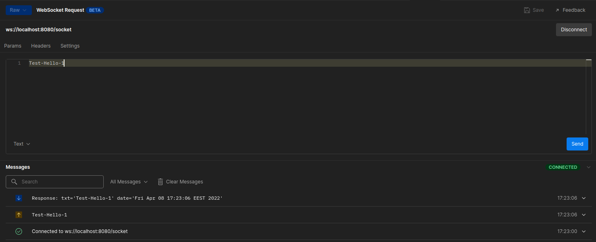
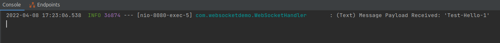
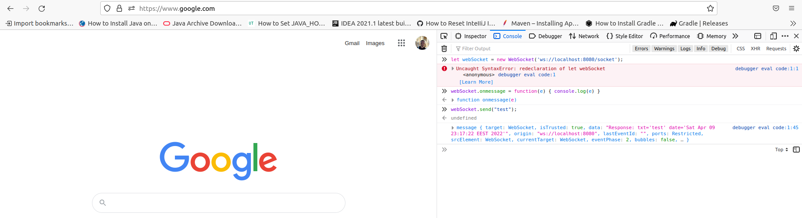
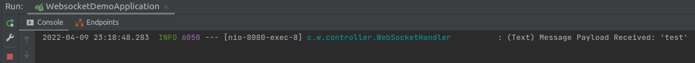

Создание сервера WebSocket с помощью Spring Boot
================================================

* [Websocket request in Postman - Websocket testing](https://www.youtube.com/watch?v=aSPHr6dbMmo)
* `Tutorial`: https://javascopes.com/creating-a-websocket-server-with-spring-boot-424o-9846dd7a
* `Repo`: https://github.com/nexmo-community/websocket-spring-boot




Server is set to listen on [ws://localhost:8080/socket](ws://localhost:8080/socket) and will respond to both binary and text messages by echoing the contents back to the sender.

Clone the project and run `gradle bootRun` to start it.

* https://www.koskila.net/how-to-test-a-web-socket-connection-in-browser
  
  ```shell
  let webSocket = new WebSocket('ws://localhost:8080/socket');
  webSocket.onmessage = function(e) { console.log(e)}
  webSocket.send("test")
  ```
  
* https://learn.javascript.ru/websocket
